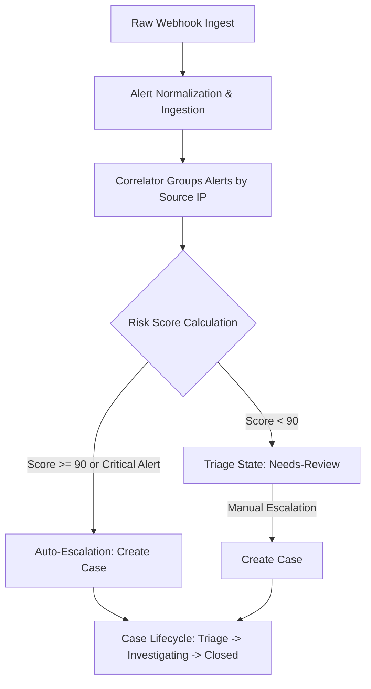

# Product Requirements Document (PRD)

## 1. Project Overview & Vision
**SentinelX** is an enterprise-grade Security Operations Center (SOC) platform designed to aggregate, normalize, correlate, and manage security alerts from heterogeneous sources (Wazuh, Suricata, Sysmon, Network ML). 

The ultimate goal of SentinelX is to mitigate **alert fatigue** by correlating individual, high-volume security alerts into consolidated **Incidents** based on common attack vectors (primarily Source IP), and escalating severe threats into formal **Cases** for manual analyst triage, investigation, and resolution.

The backend acts as the central ingestion engine, correlation brain, authentication validator, and third-party threat intelligence aggregator.

---

## 2. Target Users & Permission Matrix
The system supports three distinct user personas, each with specific access controls that must be strictly enforced by the backend API:

| Role | Persona | Key Responsibilities | Backend Scope & Permissions |
| :--- | :--- | :--- | :--- |
| **Administrator** | SOC Manager / Director | Full platform control, user management, audit review, integration settings. | `canAccessSettings`: **True**<br>`canAccessAudit`: **True**<br>`canAccessUserManagement`: **True**<br>`canAccessIntelligence`: **True**<br>`canAccessAlerts/Incidents/Cases`: **True**<br>`canEdit/Classify/Escalate/Close`: **True** |
| **SOC Analyst** | Tier 1/2/3 Security Analyst | Incident triage, alert investigation, case management, note-taking, containment. | `canAccessSettings`: **False**<br>`canAccessAudit`: **False**<br>`canAccessUserManagement`: **False**<br>`canAccessIntelligence`: **True**<br>`canAccessAlerts/Incidents/Cases`: **True**<br>`canEdit/Classify/Escalate/Close`: **True** |
| **Viewer** | Auditor / IT Operations | Read-only access to incidents for compliance monitoring. | `canAccessSettings`: **False**<br>`canAccessAudit`: **False**<br>`canAccessUserManagement`: **False**<br>`canAccessIntelligence`: **False**<br>`canAccessAlerts`: **False**<br>`canAccessIncidents`: **True** (Read-Only)<br>`canAccessCases`: **False**<br>`canEdit/Classify/Escalate/Close`: **False** |

> [!IMPORTANT]
> The backend MUST validate actions using JWT tokens and RBAC middleware. Role spoofing on the client side must be impossible; every API endpoint modification must verify that the authenticated user possesses the corresponding role.

---

## 3. The 3-Tier Security Data Pipeline
SentinelX operates on an incremental data hierarchy to turn raw security noise into actionable security stories.



### 3.1 Tier 1: Alerts (Telemetry)
*   **Definition**: A discrete security event emitted by an agent, sensor, or ML pipeline.
*   **Sources**:
    *   **Wazuh**: Host-based intrusion detection system (FIM, authentication logs, system events).
    *   **Sysmon**: Granular Windows host process auditing, memory injection, registry manipulation.
    *   **Suricata**: Network intrusion detection system (signature-based port scans, known bad User-Agents).
    *   **Network ML**: Machine learning flow classifier detecting anomalous network connections.
*   **Status**: `new` → `in-progress` → `resolved`.
*   **Data Fields Needed for Indexing**: Unique ID, Date, Time, Source, Event Type, Description, Detailed Sub-text, Source IP, Destination IP, Rule Level/Matches, MITRE Technique IDs, Assigned Analyst.

### 3.2 Tier 2: Incidents (Correlation)
*   **Definition**: A group of related alerts sharing a common **Source IP** address within a temporal window (typically a sliding window of 5 minutes).
*   **Correlation Logic**:
    *   **Risk Score**: Calculated based on the severity weights of alerts, source diversity, volume, and cross-coverage (Host + Network coverage).
    *   **Status**: `open` → `closed`.
    *   **Auto-Escalation**: Triggered automatically when the Correlation Risk Score is **≥ 90** or if a `critical` severity alert is present in the incident.
    *   **Manual Review**: Incidents scoring **< 90** are set to `needs-review`.

### 3.3 Tier 3: Cases (Formal Investigation)
*   **Definition**: A formal ticket instantiated either automatically by the correlation engine or manually by an analyst from a low-risk incident.
*   **Status Lifecycle**: `triage` → `in-progress` (Investigating) → `escalated` (tier escalations) → `closed` (Resolved).
*   **Case Content**: Linked incident data, associated alerts, dynamic timeline audit entries, target assets, containment statuses, custom note logs, and classification tags.

---

## 4. Threat Intelligence & Enrichment Requirements
When an analyst inspects an incident or case, the system must enrich the relevant **Source IP** with live threat intelligence metrics:

```
                  ┌──────────────────────────────────────────────┐
                  │                 IP ADDRESS                   │
                  └──────────────────────┬───────────────────────┘
                                         │
                  ┌──────────────────────┼───────────────────────┐
                  ▼                      ▼                       ▼
           [ VirusTotal ]           [ AbuseIPDB ]         [ MITRE ATT&CK ]
           • Reputation Score       • Confidence Score    • Auto-detection of
           • Malicious Vendor count • Total Reports Count   technique based on
           • Geolocation (Country)  • ISP Details           alert rule description
           • ASN Registration       • Usage Type            & stage ordering
```

### 4.1 VirusTotal Integration
*   Perform real-time reputation queries for malicious indicators on external source IPs.
*   Collect:
    *   *Reputation score* (negative values imply malicious).
    *   *Malicious/Suspicious/Harmless/Undetected counts* from anti-virus engines.
    *   *Country and ASN details* for geo-fencing validation.

### 4.2 AbuseIPDB Integration
*   Perform abuse reporting checks to determine if the IP is a known attacker node.
*   Collect:
    *   *Abuse confidence score* (0-100%).
    *   *Total abuse reports* registered against this IP.
    *   *ISP details* (e.g., DigitalOcean, Amazon AWS, Tor Exit Node, Proxy, VPN).
    *   *Usage type* (Data Center, Hosting, Residential).

### 4.3 MITRE ATT&CK Integration
*   Automatically map alerts to specific MITRE tactics and techniques.
*   The mapping is based on regex-matching alert metadata:
    *   *Credential Access*: Detected during SSH/brute-force failures (Technique **T1110 - Brute Force**).
    *   *Discovery*: Network port scanning / SYN reconnaissance (Technique **T1046 - Network Service Discovery**).
    *   *Execution*: Suspect process creation or scripts (Technique **T1059 - Command and Scripting Interpreter**).
    *   *Privilege Escalation / Defense Evasion*: LSASS memory injection or process manipulation (Technique **T1055 - Process Injection**).
    *   *Command & Control (C2)*: Outbound anomalies, ML malicious traffic patterns (Technique **T1071 - Application Layer Protocol**).

---

## 5. Webhook Intake Requirements
The platform's frontend relies on immediate notification when critical events occur. The backend webhook must:
1.  Provide a single stateless endpoint: `POST /api/v1/webhooks/alerts`.
2.  Ingest unstructured JSON payloads.
3.  Support rapid normalization, validation, and database ingestion.
4.  Run asynchronous background queues to parse rules and execute the correlator engine to prevent webhook timeouts.
5.  Push real-time updates to active analyst browsers via WebSockets (e.g., Laravel Echo / Pusher).
