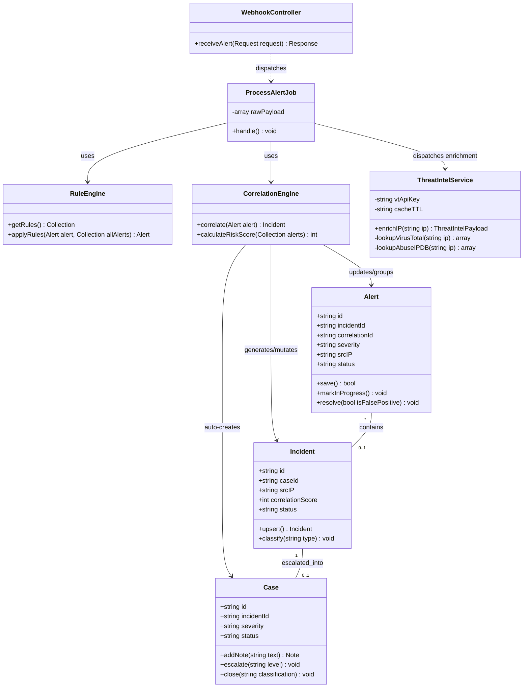
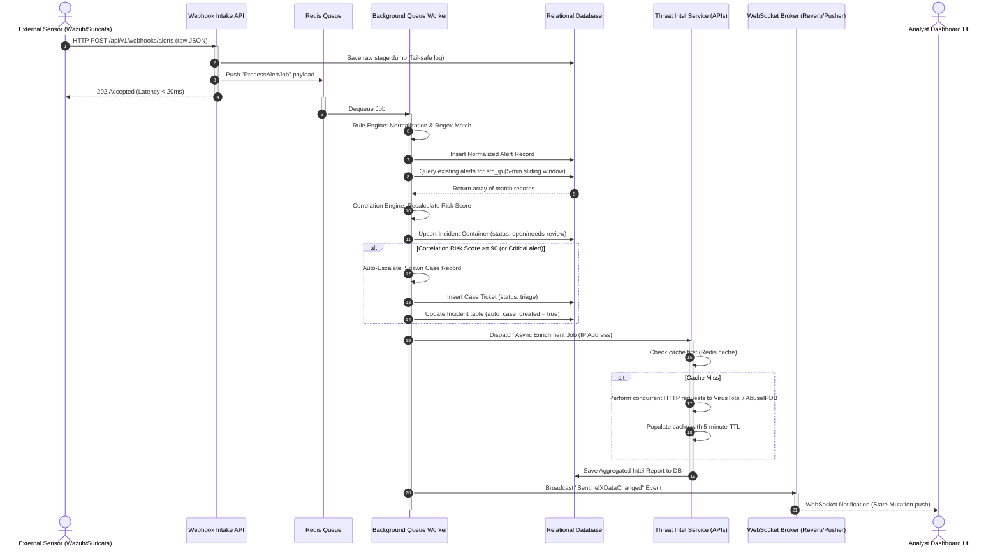
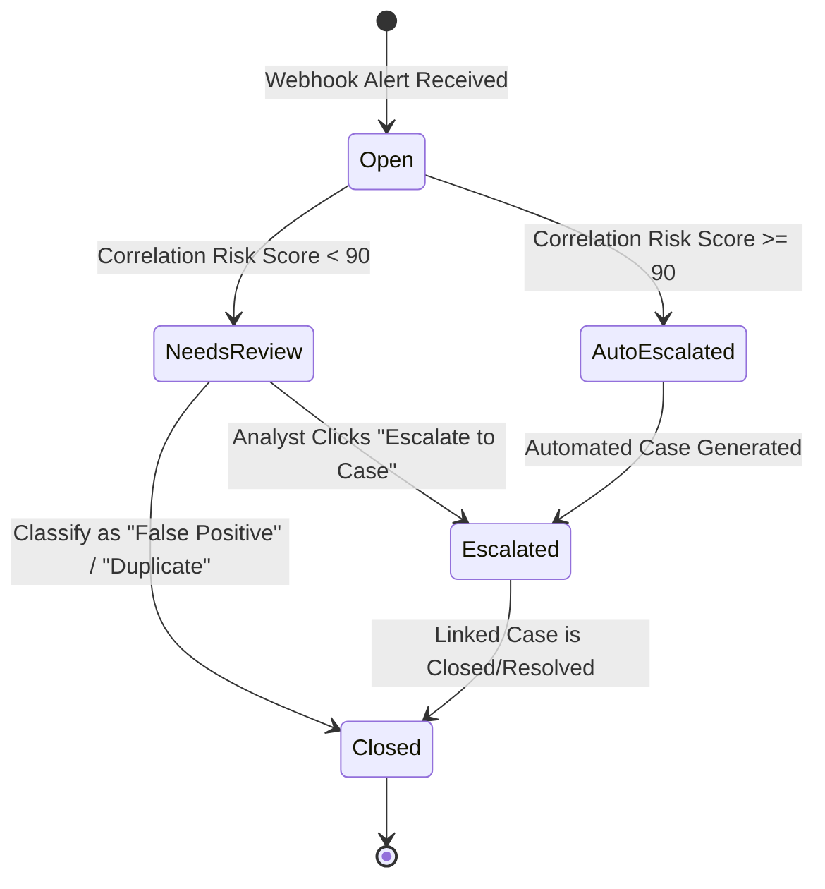
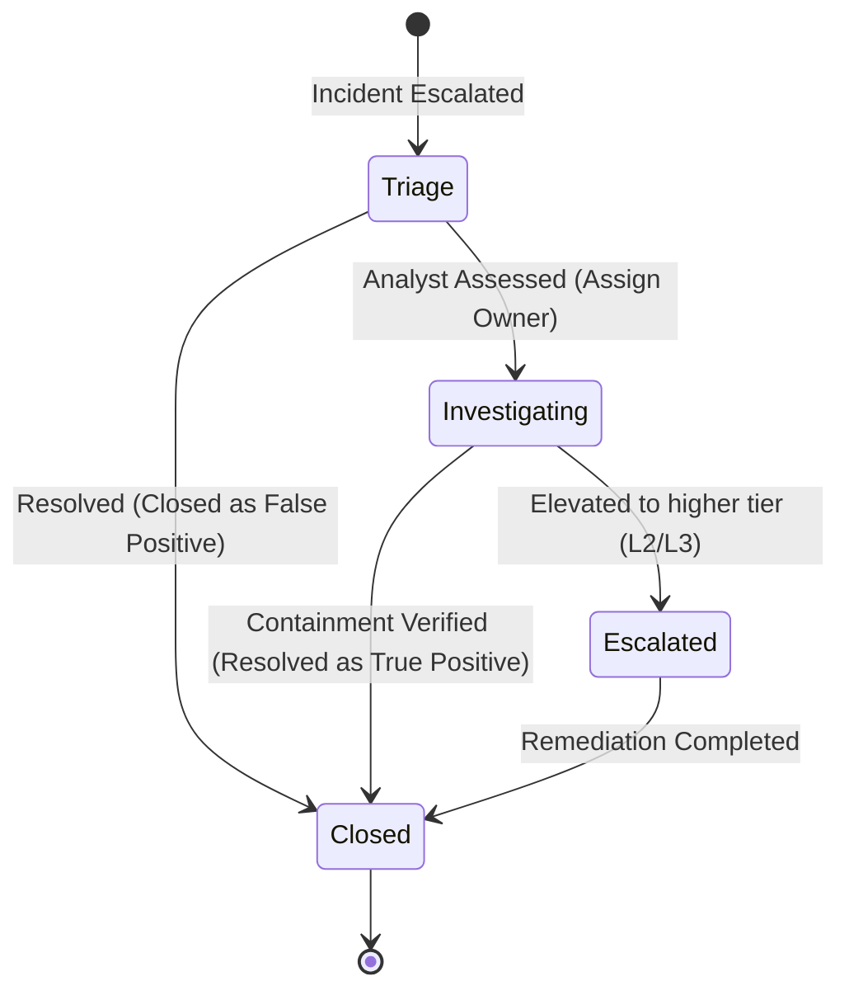

# UML Architecture & Sequence Diagrams

This document contains visual UML diagrams mapping out the classes, lifecycles, and asynchronous processing sequence of **SentinelX**. The diagrams are formatted using Mermaid JS syntax for native markdown rendering.

---

## 1. Class Diagram
Maps the relationships, fields, and operations of controllers, models, and service classes within the backend logic layer.

---

## 2. Webhook Telemetry Processing Sequence Diagram
Traces the execution path from an external sensor webhook request through the database write, background worker queues, threat intelligence enrichments, and final real-time UI notification updates.

---

## 3. Incident & Case Status State Machines
Outlines the logic flow and transitions governing state mutations. The backend must enforce that no terminal state (e.g., Closed) can transition backwards without strict privilege checks.

### 3.1 Incident State Transition Lifecycle

### 3.2 Case State Transition Lifecycle

